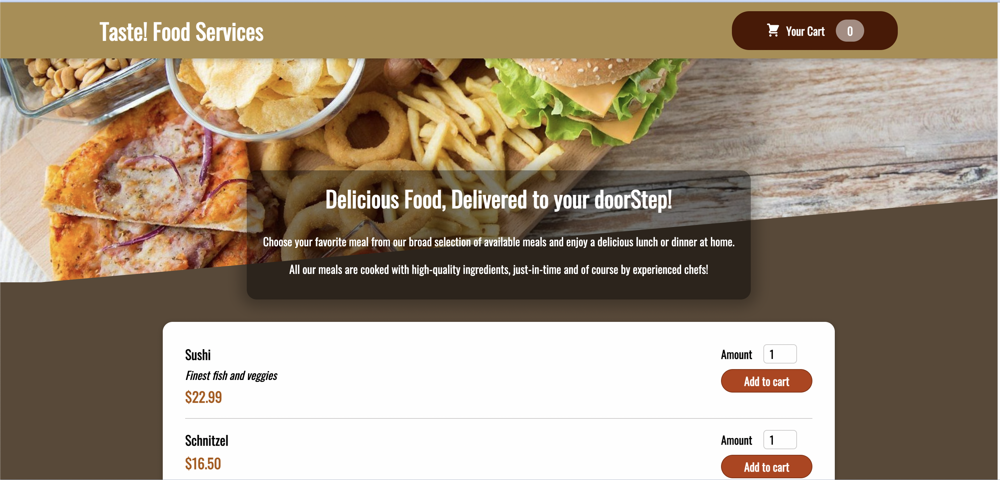

# React-Food-Ordering-App
 

## About this project 
Food ordering app is website for ordering food and sending feedback for the user when order is sent using a firebase database <br/> 
<div align="center" >

</div>

## the project uses react hooks such as :

<ul>
   <li>
   useState
   </li>
   <li>
   useRef
   </li>
   <li>
   useEffect
   </li>
   <li>
   useContext
   </li>
</ul>


### Installation
1. Clone the repo 
```sh
git clone https://github.com/SalmaaOsamaa/React-Food-Ordering-App.git
```

2. install dependenscies
 ```bash
   npm install
  ```
   
3. run the project 
```bash
   npm start
   ```
